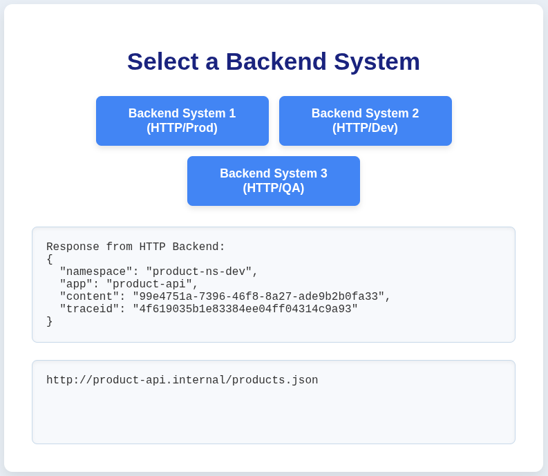

# Simple Header based backend Routing deployment

Target for this POC, ServiceMesh configured Frontend and multiple Backend Applications. Being reachable through the Frontend by adjusting only the header in the request without changing the Backend API uri/host.

This use-case is for Demo purpose only as GitOps and CI/CD best-practice recommend to have a strict separation between various Stages (Prod/QA/Dev) to avoid hitting the wrong backend in Production by configuration mistakes.

## Application description

### Frontend Application

The Frontend Application is a simple Python AIOHTTP based Service which provides a simple UI on the default page. The Pages uses JavaScript to reload the DOM without the need to get the mesh external entity (like a Browser) execute another call and to remove the need to expose the Backends on the Public route. Still for the show-case a Header based match for those three backends is configured on the VirtualService to reach the default endpoint of the Backends also from an external entity like curl.

### Backend Application

The Backend Application is a simple Python AIOHTTP based service which returns it's namespace on the default endpoint and on any other HTTP path  JSON formatted content simulating some data access being returned. 

## Visibility and observability

Traces, Logs and metrics have been implemented into both Applications. That provides the possibility to configure the included OTEL collectors to forward those to your desired Storage endpoints for each signal. 

* The Metrics endpoint is prometheus scratch able at `/metrics` 
* The Traceparent ID will be reported in the headers as well as in the requests for easier correlation
* The Logs are being send to Loki and are enhanced with trace_id, span_id, and trace_flags which makes correlation easy compared to time-range query limitation


## Building the Application images

Both Applications are based on Python3.13 and Fedora42. To build them execute the following commands

* build the Frontend Application by executing following command

```
podman build -f frontend/Dockerfile -t <your-registry>/<organization>/<image-name>:<image-tag>
```

* build the Backend Application by executing following command
```
podman build -f backend/Dockerfile -t <your-registry>/<organization>/<image-name>:<image-tag>
```

Push the images to your registry to have access in an OpenShiftCluster for deploying them

* push the Frontend Application by executing following command

```
podman push <your-registry>/<organization>/<image-name>:<image-tag>
```

* push the Backend Application by executing following command
```
podman push <your-registry>/<organization>/<image-name>:<image-tag>
```

## Deploying the Application

### Red Hat OpenShift ServiceMesh 3.x

* Deploy the OpenShift ServiceMesh Operator 3.x subscription by executing following command

```
cat <<EOF | oc create -f -
apiVersion: operators.coreos.com/v1alpha1
kind: Subscription
metadata:
  labels:
    operators.coreos.com/servicemeshoperator3.openshift-operators: ''
  name: servicemeshoperator3
  namespace: openshift-operators
spec:
  channel: stable
  installPlanApproval: Automatic
  name: servicemeshoperator3
  source: redhat-operators
  sourceNamespace: openshift-marketplace
---
EOF
```

* Create the `istio-system` namespace to deploy your ServiceMesh Pilot by executing following command

```
oc create namespace istio-system
```

* Create the Istio CNI instance by executing the following command

```
# ensure to adjust the version to what the Operator provides and supports
cat <<EOF | oc -n istio-system create -f -
apiVersion: sailoperator.io/v1
kind: IstioCNI
metadata:
  name: default
spec:
  namespace: istio-system
  version: v1.24.5
---
EOF
```

* Create the Istio Pilot instance by executing the following command

```
# ensure to adjust the version to what the Operator provides and supports
cat <<EOF | oc -n istio-system create -f -
apiVersion: sailoperator.io/v1
kind: Istio
metadata:
  name: default
spec:
  namespace: istio-system
  updateStrategy:
    inactiveRevisionDeletionGracePeriodSeconds: 30
    type: InPlace
  values:
    meshConfig:
      defaultConfig:
        proxyMetadata:
          ISTIO_META_DNS_AUTO_ALLOCATE: 'true'
          ISTIO_META_DNS_CAPTURE: 'true'
      defaultProviders:
        tracing:
          - otel
      extensionProviders:
        - name: otel
          opentelemetry:
            port: 4317
            service: user-collector.istio-system.svc.cluster.local
    pilot:
      autoscaleBehavior: {}
      autoscaleEnabled: true
      autoscaleMax: 5
      autoscaleMin: 2
    telemetry:
      enabled: true
      v2:
        enabled: true
        prometheus:
          enabled: true
  version: v1.24.5
---
EOF
```

* Wait for the Istio Pilot to come up and be ready.
* The Istio configuration defines the OTEL provider for collecting logs. If you do not want to use OTEL ignore that configuration.
* To create an OTEL collector as configured in this example follow these [instructions](#OTEL)

### Deploying the Backend Applications

* Ensure to adjust the namespace labels in `backend/namespace.yml` according to your ServiceMesh discovery selection.
* Ensure to adjust the image used by editing the `deploy/frontend/kustomization.yaml` and `deploy/backend/kustomization.yaml` files
* Deploy the production namespace application by executing the following command

```
export REV=default
export NAMESPACE=product-ns-prod
kustomize build deploy/backend/|envsubst|oc create -f -
```

* Deploy the qa namespace application by executing the following command

```
export REV=default
export NAMESPACE=product-ns-qa
kustomize build deploy/backend/|envsubst|oc create -f -
```

* Deploy the dev namespace application by executing the following command

```
export REV=default
export NAMESPACE=product-ns-dev
kustomize build deploy/backend/|envsubst|oc create -f -
```

* Verify that all three namespaces have the `product-api` pods running by excuting following command

```
oc get pods -A -l app=product-api
```

Example output
```
NAMESPACE         NAME                           READY   STATUS    RESTARTS   AGE
product-ns-dev    product-api-69b4f6b789-vzk6w   3/3     Running   0          55m
product-ns-prod   product-api-69b4f6b789-bggfd   3/3     Running   0          52m
product-ns-qa     product-api-69b4f6b789-jqm4v   3/3     Running   0          55m
```

### Deploying the Frontend Application

* Ensure to adjust the namespace labels in `backend/namespace.yml` according to your ServiceMesh discovery selection.
* Ensure to set `EXTERNALNAME` when deploying to adjust the Full Qualified Domain Name to access the application in the Cluster.
* Ensure to configure your TLS Secret in `deploy/gateway/secret.yml` to provide a valid Certificate for your ServiceMesh Gateway.
* Deploy the frontend namespace application by executing the following command

```
export REV=default
export NAMESPACE=frontend-ns
export EXTERNALNAME=frontend.apps.example.com

kustomize build deploy/frontend|envsubst|oc create -f -
```

## Accesing the Frontend Application

### Browser based
To access the Frontend Application open your Browser and point it to your `EXTERNALNAME` specified FQDN.


Click each Button to see the different outputs of the backends.




### Kiali visualiation

Open your Kiali instance to show the flow between the applications.


### CLI based
To access the Frontend Application with a cli tool like `curl` execute the following commands to retrieve your backend content.

* For accessing product-ns-prod namespace backend execute the following command
```
curl https://${EXTERNALNAME}/backend1 -s | jq -r 
```

* For accessing product-ns-dev namespace backend execute the following command
```
curl https://${EXTERNALNAME}/backend2 -s | jq -r
```

* For accessing product-ns-qa namespace backend execute the following command
```
curl https://${EXTERNALNAME}/backend3 -s | jq -r
```

* Direct backend access through cli Headers can be done by executing following command

* For directly accessing product-ns-prod namespace backend execute the following command
```
curl https://${EXTERNALNAME}/ -H "x-target-env: prod" -s | jq -r 
```

* For directly accessing product-ns-qa namespace backend execute the following command
```
curl https://${EXTERNALNAME}/ -H "x-target-env: qa" -s | jq -r 
```

* For directly accessing product-ns-dev namespace backend execute the following command
```
curl https://${EXTERNALNAME}/ -H "x-target-env: dev" -s | jq -r 
```

# OTEL

Setting up an OpenTelemetry Collector for trace collection execute the following commands

* Create the OpenShift OpenTelemetry Namespace by executing the following command
```
oc create namespace openshift-opentelemetry-operator
```

* Deploy the OpenShift OpenTelemetry Operator group by executing the following command

```
cat <<EOF | oc create -f -
apiVersion: operators.coreos.com/v1
kind: OperatorGroup
metadata:
  annotations:
    olm.providedAPIs: Instrumentation.v1alpha1.opentelemetry.io,OpAMPBridge.v1alpha1.opentelemetry.io,OpenTelemetryCollector.v1alpha1.opentelemetry.io,OpenTelemetryCollector.v1beta1.opentelemetry.io,TargetAllocator.v1alpha1.opentelemetry.io
  name: openshift-opentelemetry-operator
  namespace: openshift-opentelemetry-operator
spec:
  upgradeStrategy: Default
---
EOF
```

* Deploy the OpenShift OpenTelemetry Operator subscription by executing the following command

```
cat <<EOF | oc create -f -
apiVersion: operators.coreos.com/v1alpha1
kind: Subscription
metadata:
  labels:
    operators.coreos.com/opentelemetry-product.openshift-opentelemetry-operator: ''
  name: opentelemetry-product
  namespace: openshift-opentelemetry-operator
spec:
  channel: stable
  installPlanApproval: Automatic
  name: opentelemetry-product
  source: redhat-operators
  sourceNamespace: openshift-marketplace
---
EOF
```

* Wait for the Operator to deploy
* Create a tenant configured Collector for integration into OpenShift Cluster Observability Operator tracing UI plugin
* Deploy the OTEL collector by executing the following command

```
cat <<EOF | oc create -f -
apiVersion: opentelemetry.io/v1beta1
kind: OpenTelemetryCollector
metadata:
  name: user
  namespace: istio-system
spec:
  config:
    connectors:
      spanmetrics:
        dimensions:
          - name: k8s.namespace.name
        metrics_flush_interval: 5s
    exporters:
      otlp:
        auth:
          authenticator: bearertokenauth
        endpoint: tempo-gateway.tempo.svc.cluster.local:8090
        headers:
          X-Scope-OrgID: user
        tls:
          ca_file: /var/run/secrets/kubernetes.io/serviceaccount/service-ca.crt
      prometheus:
        add_metric_suffixes: false
        endpoint: 0.0.0.0:8889
        resource_to_telemetry_conversion:
          enabled: true
    extensions:
      bearertokenauth:
        filename: /var/run/secrets/kubernetes.io/serviceaccount/token
    processors:
      k8sattributes: {}
    receivers:
      jaeger:
        protocols:
          thrift_compact:
            endpoint: 0.0.0.0:6831
      otlp:
        protocols:
          grpc:
            endpoint: 0.0.0.0:4317
          http:
            endpoint: 0.0.0.0:4318
    service:
      extensions:
        - bearertokenauth
      pipelines:
        metrics:
          exporters:
            - prometheus
          receivers:
            - spanmetrics
        traces:
          exporters:
            - otlp
            - spanmetrics
          processors:
            - k8sattributes
          receivers:
            - otlp
            - jaeger
      telemetry:
        metrics:
          address: 0.0.0.0:8888
  configVersions: 3
  daemonSetUpdateStrategy: {}
  deploymentUpdateStrategy: {}
  ingress:
    route: {}
  ipFamilyPolicy: SingleStack
  managementState: managed
  mode: deployment
  observability:
    metrics:
      enableMetrics: true
  podDnsConfig: {}
  replicas: 1
  resources: {}
  targetAllocator:
    allocationStrategy: consistent-hashing
    collectorNotReadyGracePeriod: 30s
    filterStrategy: relabel-config
    observability:
      metrics: {}
    prometheusCR:
      scrapeInterval: 30s
    resources: {}
  upgradeStrategy: automatic
---
EOF
```

* For integrating the OTEL collector into a TempoStack and into the UI please follow these [instructions](https://github.com/michaelalang/ossm-distributed-tracing)


